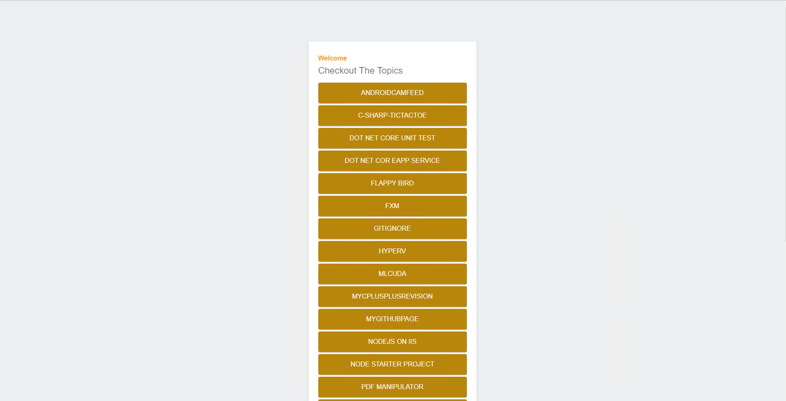
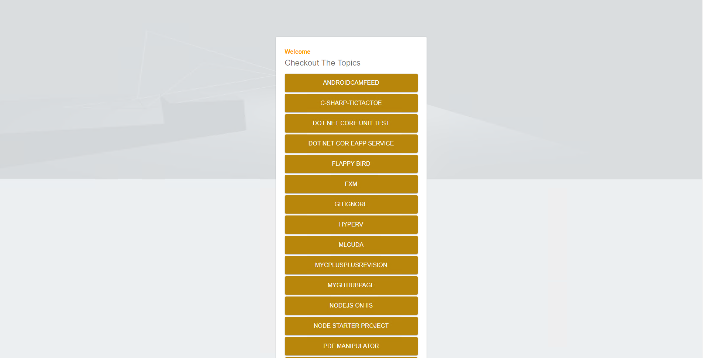

# FXM in Action

A simple local project to explore the potensial of FXM

## Explored
    - TDS and unicorn to sync items
    - FXM to make a static banner and paste it on a local site

### Local Site Without FXM

### Local Site With FXM

### Instructions
* local project is at nodelocal folder. Need to host on iis. A static html and linked with javascript. Just used GIT api to get my public repos.
* Need to use either TDS or Unicorn. To use TDS just sync and you will be ok(Remember to change the build properties). For unicorn you must publish the unicorn project. Remember to fix the publlish config accourding to user folder locations.

## References
01. [FXM strongholds and limitations](https://doc.sitecore.net/sitecore_experience_platform/digital_marketing/federated_experience_manager/configuring/the_requirements_and_limitations_of_fxm)
02. [Unicorn config set up helper](https://github.com/SitecoreUnicorn/Unicorn)
03. [Need to dig deep in TDS Habitat project](https://www.teamdevelopmentforsitecore.com/-/media/TDS/Files/Whitepapers/Sitecore-TDS-helix-whitepaper%20V1.pdf)